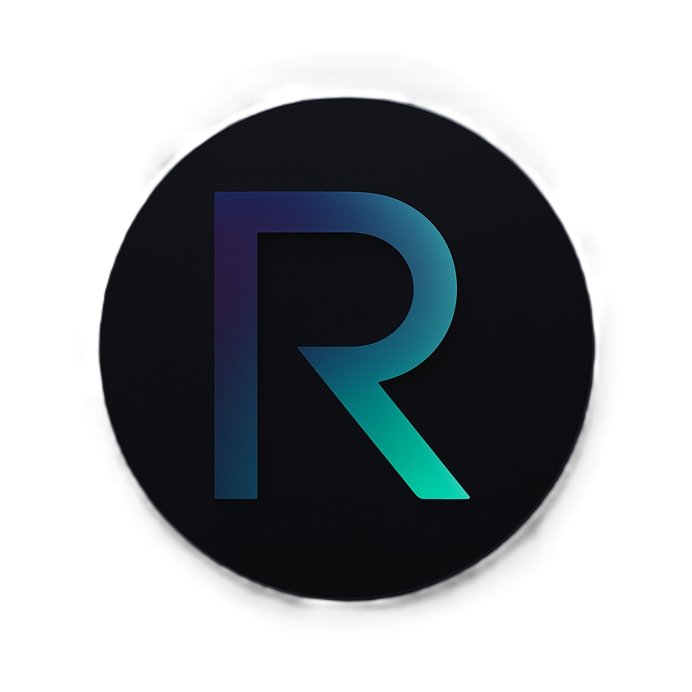
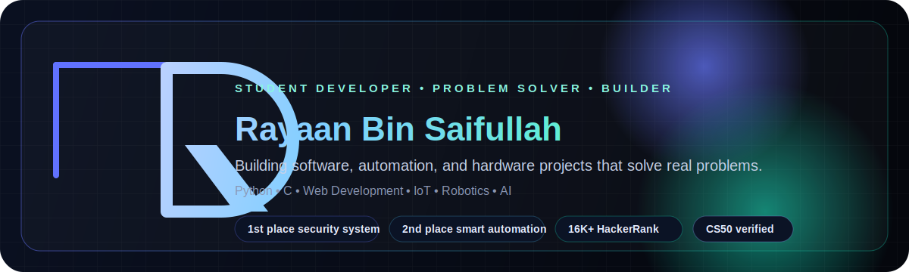

  
   
   
  
   
   

  
  
  
  
  
  

   
   

  

<table>
  <tr>
    <td width="58%" valign="top">

## Building things that matter

I am Rayaan Bin Saifullah, a 17-year-old student developer focused on software, automation, and hardware projects that solve real problems.

- Built a Smart Home Automation System with Google Assistant and Alexa integration and placed 2nd in a school competition.
- Created an Intelligent Security System with RFID, PIN access, and robotics and placed 1st in a school competition.
- Ranked 16,516 globally in HackerRank Python with a score of 2302.13 out of 2305.
- Completed CS50's Introduction to Computer Science through Harvard and edX.
- Currently exploring AI, problem solving, and sharper frontend engineering.

## Current focus

- Python and C projects with practical outcomes
- AI and automation experiments
- UI work that feels clean, modern, and intentional
- Open-source collaboration and constant skill growth

    </td>
    <td width="42%" valign="top" align="center">
      
       
       
      
       
      
       
      
       
      
    </td>
  </tr>
</table>

## Selected work

| Project | Snapshot | Link |
| --- | --- | --- |
| Smart Home Automation System | Voice-controlled automation with Google Assistant and Alexa. | [Portfolio](https://rayaan2009.github.io/itsactuallyrayaan/#/) |
| Intelligent Security System | RFID and PIN-based access with robotics for automated responses. | [Portfolio](https://rayaan2009.github.io/itsactuallyrayaan/#/) |
| Python Projects | Algorithms, problem solving, tooling, and small experiments. | [GitHub](https://github.com/Rayaan2009) |

## Verified achievements

| Achievement | Issuer | Link |
| --- | --- | --- |
| CS50's Introduction to Computer Science | Harvard University (edX) | [Certificate](https://courses.edx.org/certificates/cfd642062ecd466faf347bc64f18cbe4) |
| Python (Basic) | HackerRank | [Certificate](https://www.hackerrank.com/certificates/7fd2b6f079b3) |
| CSS (Basic) | HackerRank | [Certificate](https://www.hackerrank.com/certificates/a1d3a48ffae6) |
| Problem Solving (Basic) | HackerRank | [Certificate](https://www.hackerrank.com/certificates/39a68d5bf0ae) |
| Problem Solving (Intermediate) | HackerRank | [Certificate](https://www.hackerrank.com/certificates/54bb17bea4dc) |

## Stack

### Languages

### Tools

## GitHub pulse

  
  

  

  

## Breakout

<picture>
  <source media="(prefers-color-scheme: dark)" srcset="https://raw.githubusercontent.com/Rayaan2009/Rayaan2009/github-breakout/images/breakout-dark.svg" />
  <source media="(prefers-color-scheme: light)" srcset="https://raw.githubusercontent.com/Rayaan2009/Rayaan2009/github-breakout/images/breakout-light.svg" />
  
</picture>

  If you want to build something useful together, reach out through LinkedIn or email.

